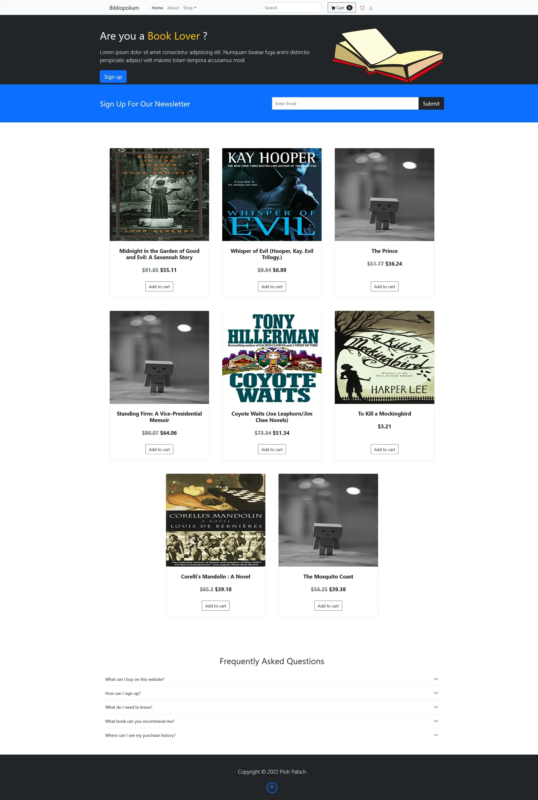
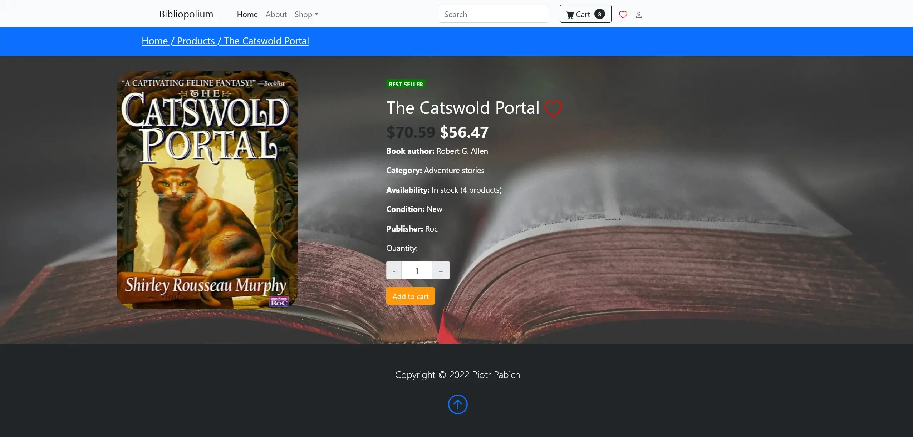
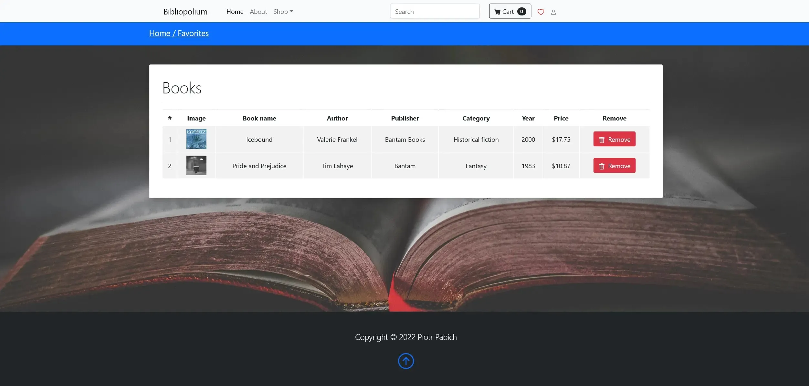
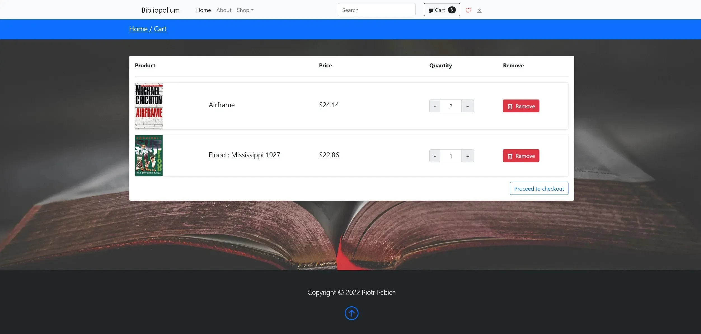
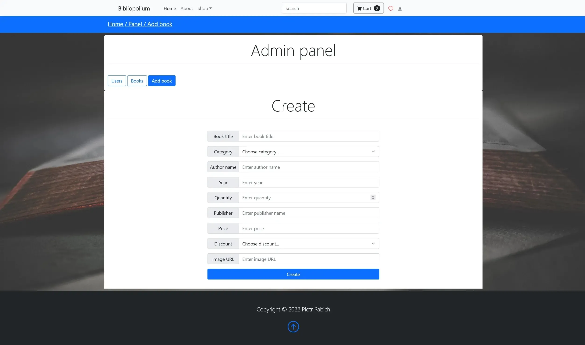
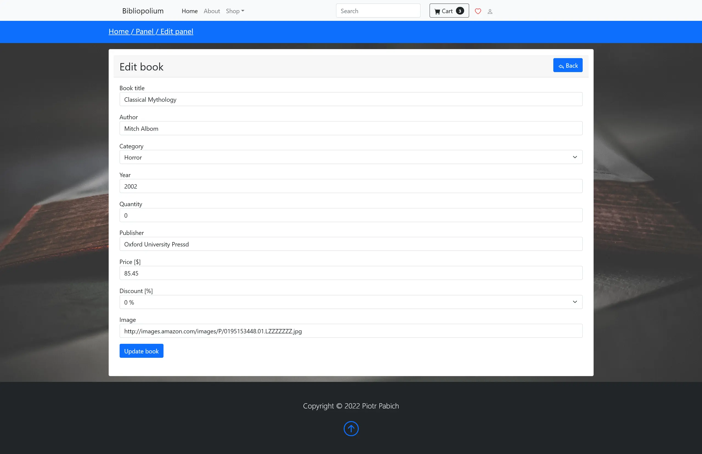
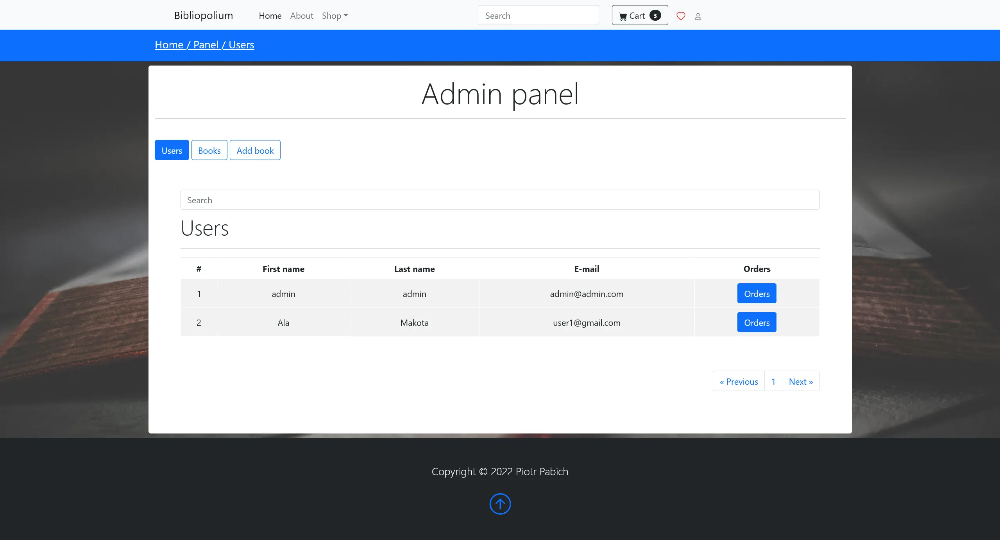
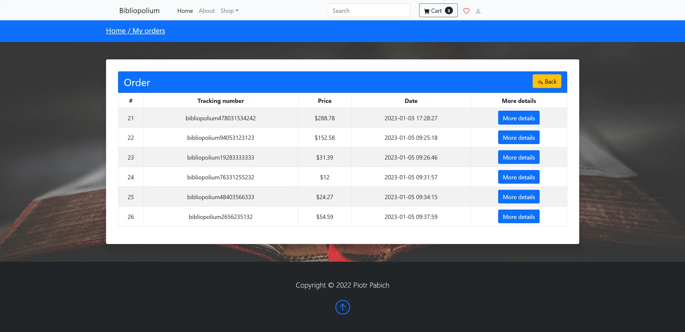
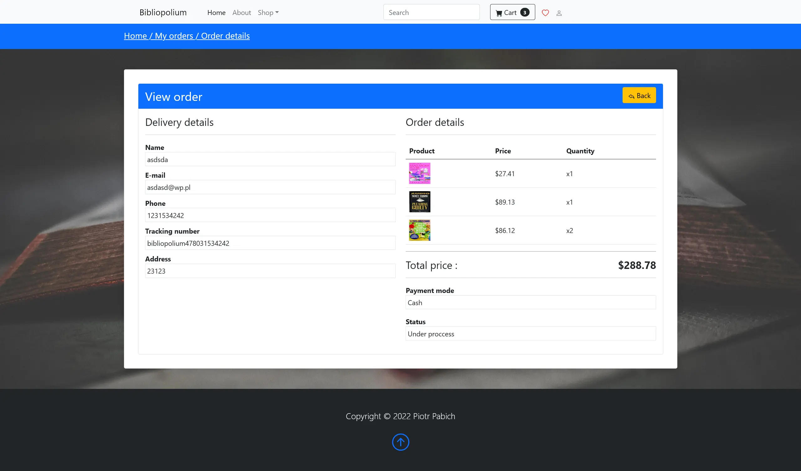

# ecommerce-store-php

This is a simple web application for a student project written in pure PHP for educational purposes.

## Technologies used

- PHP
- HTML
- CSS
- JavaScript
- MySQL
- XAMPP

## App features

- Register and login form
- User can have list with favourite items
- Items in cart remembered from session
- protection against SQL injection
- protection against Cross Site-Scripting
- Admin panel with CRUD actions
- Order details after purchase

## App preview

Index

Login form

Register form

Book

Favourites items

Cart

Admin - add new book

Admin - edit book

Admin - users

Orders

Order details

